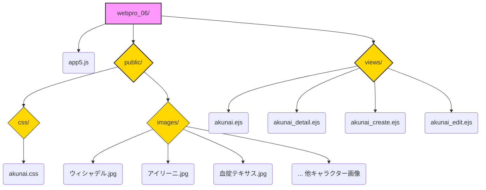

```mermaid
graph TD
    %% ルートディレクトリ
    root[webpro_06/]
    
    %% 第1階層
    root --> app5(app5.js)
    root --> public{public/}
    root --> views{views/}

    %% publicフォルダの中身
    public --> css{css/}
    public --> images{images/}

    %% cssフォルダ
    css --> cssFile(akunai.css)

    %% imagesフォルダ
    images --> img1(ウィシャデル.jpg)
    images --> img2(アイリーニ.jpg)
    images --> img3(血掟テキサス.jpg)
    images --> imgEtc(... 他キャラクター画像)

    %% viewsフォルダの中身
    views --> v1(akunai.ejs)
    views --> v2(akunai_detail.ejs)
    views --> v3(akunai_create.ejs)
    views --> v4(akunai_edit.ejs)

    %% ノードのスタイル設定（フォルダを黄色、ファイルを青っぽくなど）
    style root fill:#f9f,stroke:#333,stroke-width:2px
    style public fill:#ffd700,stroke:#333,stroke-width:2px
    style views fill:#ffd700,stroke:#333,stroke-width:2px
    style css fill:#ffd700,stroke:#333
    style images fill:#ffd700,stroke:#333
```