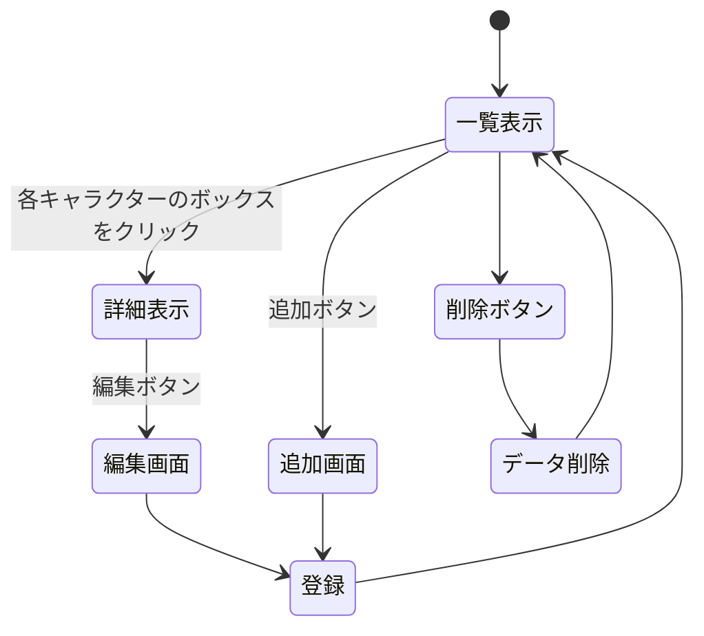

# アークナイツの好きなキャラクター紹介Webサイト 開発者仕様書（仮） 

### 25G1113　廣岡花
## 1.はじめに
###　1.1.開発目的
本システムはWebサイト上で自分が好きなアークナイツのキャラクター紹介を行うことを目的とする．作品の情報を手早く参照できること，および将来的な拡張（編集，追加，削除）を容易に行えることを目標とする．
### 1.2.開発環境
| 項目 | 内容 |
| ---- | ---- |
| OS | macOS Sequoia version 15.6 |
| 言語 | JavaScript，CSS，EJS |
| 開発ツール | Visual Studio Code |

## 2.システム概要
### 2.1.データ構造
本システムでは，紹介対象のキャラクターを次のデータ項目で表現する．
`codename`（コードネーム/表示名）
`star`（レアリティ）
`job`（職業）
`job2`（職分）
`birth`（誕生日）
`CV`（担当声優）
`personal_history`（キャラクターの個人履歴）
`my_comment`（編集者のコメント）
`images`（画像）
### 2.2.ページ構造
本システムのページは合わせて4ページで構成され，一覧表示，詳細表示，データの追加，データの編集を行えるページを作成する．削除については一覧表示に備え付けるように配置した削除ボタンで行い，専用のページは作成しない．
### 2.3.ページ遷移

上図に本システムのページ遷移を示す．また，URLのリソース名は下記のように定める．`:number`には一覧表示ページで選択したキャラクターの配列の番号が入力される．
`/akunai` 一覧
`/akunai/create` 新規フォーム
`/akunai/:number` 詳細
`/akunai/:number/edit` 編集

### 2.4.リソースごとの詳細説明
### /akunai キャラクター一覧表示
目的：全キャラクターの`codename`，`images`（画像），`job`（職業）をカードのように一覧表示する．各カードは詳細ページへのリンクと削除ボタンを持つ．
入力：サーバ側が`aknai`配列を渡す．
出力：
テンプレート：views/akunai.ejs
渡す変数：`{aknai:aknai}`（配列）
各要素は
`codename`，`star`，`job`，`job2`，`birth`，`CV`，`personal_history`，`my_comment`を含む．
UI挙動：各カードをクリックすると/akunai/:numberへ移動する．カード下の削除ボタンは`POST`/akunai/:number/deleteを呼ぶ（フォーム送信）．画面下には新規登録ボタンがあり，/akunai/createへ移動する．

### /akunai/create　新規登録ページ
目的：新規キャラクター追加用のページを表示する．
入力：`codename`（必須），`star`（数値），`job`，`job2`，`birth`，`CV`，`personal_history`，`my_comment`
出力：
テンプレート：views/akunai_create.ejs
渡す変数：なし
UI挙動：フォーム送信は`POST`/akunai/create
キャンセルボタンが存在し/akunaiへ戻る．

### /akunai/:number　詳細ページ
目的：指定された:number（配列の番号）の対応するキャラクターの詳細ページを表示する．
入力：:number
出力：
テンプレート：views/akunai_detail.ejs
渡す変数：{data:item,id:number}（.js）
UI挙動：編集ボタンを配置し，/akunai/:number/editへ移動する．戻るボタンは/akunai（一覧表示）．画像表示は/images/{codename}.jpgを使用．

### /akunai/:unmber/edit　編集ページ
目的：ユーザーが変更した情報を保存し，詳細ページへリダイレクトする．
入力：`codename`，`star`，`job`，`job2`，`birth`，`CV`，`personal_history`，`my_comment`
出力：
テンプレート：views/akunai_edit.ejs
渡す変数：{data:aknai[number],id:number}（.js）
UI挙動：画面にキャンセルボタンを配置し，前ページの/akunai/:numberへ戻る．

### `POST`/akunai/:number/delete 　削除
目的：対象キャラクターを一覧から削除する．
入力：:number
出力：なし（実装は全て.jsファイルで行い専用ページは制作しない．）
備考：削除ボタンを押したら確認ダイアログを入れてデータの安全性を確保する．

